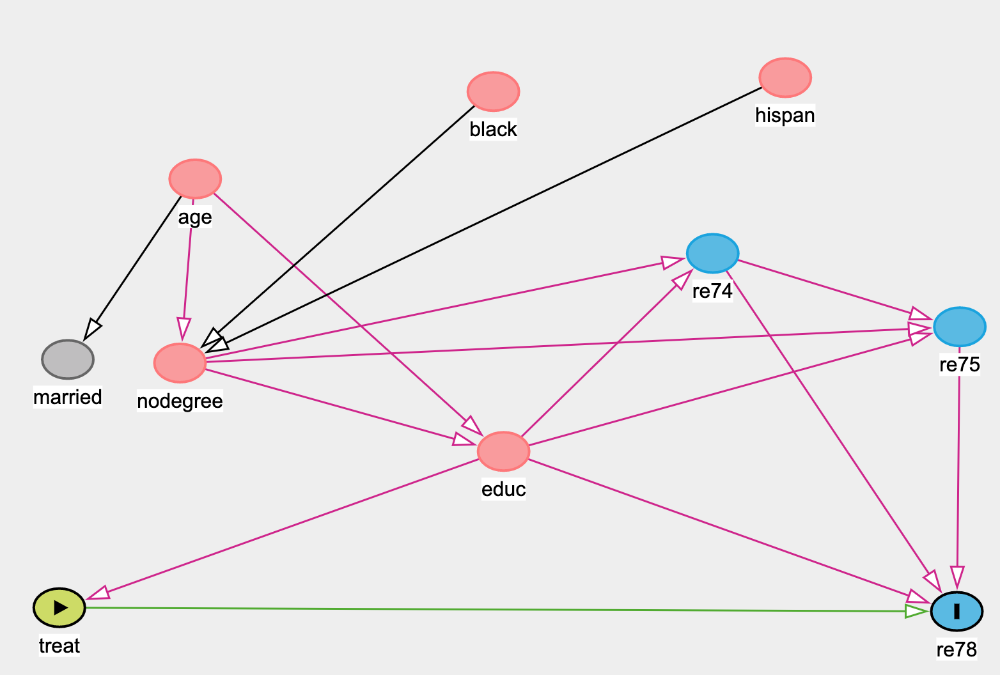

```{r setup, include=FALSE}
knitr::opts_chunk$set(echo = FALSE)
library(tidyverse)
library(tableone)
library(mlogit)
library(personalized)
library(ri)
```

# Part 1

```{r}
### read in data
salary_dat <- read_csv("/Users/SabrinaLin/Documents/Fall_2020_Causal_Inference/Homework/HW3/p8122_hw3_stl2137/hW3\ data.csv") %>% 
  mutate(
    treat = as.factor(treat),
    black = as.factor(black),
    hispan = as.factor(hispan),
    married = as.factor(married),
    nodegree = as.factor(nodegree)
  )

salary_dat <- as.data.frame(salary_dat)
```

* data consists of 10 variables measured for each individual:

  * an indicator of treatment assignment (job training), `treat` 
  
  * age in years, `age`
  
  * education in years, `educ`
  
  * an indicator for African-American, `black` 
  
  * an indicator for Hispanic, `hispan`
  
  * an indicator for married, `married`
  
  * an indicator for high school degree, `nodegree`
  
  * income in 1974, `re74` 
  
  * income in 1975 `re75` 
  
  * income in 1978, `re78`

* The variable `treat` is the treatment and the variables `re78` is the outcome.

## Subpart 1
Write the DAG representing this observational study including all variables provided. Describe all the variables in the graph.

```{r, out.width= 50%}
### include screenshot of DAG from `daggity`  

```

* Based off the DAG, `nodegree` is a collider between `black` and `hispanic`, so we will not adjust for it. 

* There is no backdoor path with `married`, so we will not adjust for it. 

## Subpart 2
Evaluate covariate balance in this observational study. Show a table or a plot. Interpret the results.

```{r}
## Construct a table
vars <- c("age", "educ", "black", "hispan", "re74", "re75")

tab_presub <- CreateTableOne(vars = vars, strata = "treat", data = salary_dat, test = FALSE)

print(tab_presub, smd = TRUE)
```

* Given that we would like the SMD to be less than 0.2 and having seen 0.25 as a common guideline for SMD in the literature, there are several variables that surpass this rule of thumb. The SMD (standardized mean difference) for the variable `black` is very large at 1.671, indicating that the covariate balance for this variable is not good. The variable`re74` also has a  relatively large SMDs (0.596 respectively), also indicating that the covariate balance for `re74` is not great. 

## Subpart 3
The propensity score is defined as the probability of receiving the treatment given the observed covariates. These scores are used to construct strata within which we assume that the exposure assignment is random. Construct propensity scores by fitting a logistic regression to the data.

```{r}
salary_mlogit_dat <- mlogit.data(salary_dat, choice = "treat", shape = "wide")
fit_sal <- mlogit(treat ~ 0 | age + educ + black + hispan +  re74 + re75, data = salary_mlogit_dat)
summary(fit_sal)

ps_model <- glm(treat ~ age + educ + black + hispan + re74 + re75, data = salary_dat, family = binomial)
summary(ps_model)

salary_dat$ps <- predict(ps_model, type = "response")
```

## Subpart 4
Given the propensity scores estimated, evaluate overlap. Trim data if necessary and evaluate the impact of trimming in your analytic sample on efficiency and generalizability.

```{r}
### visualization of overlap 

prop_func <- function(x, trt)
{
    # fit propensity score model
  propens.model <- glm(treat ~ age + educ + black + hispan + re74 + re75, data = salary_dat, family = binomial)
  pi.x <- predict(propens.model, type = "response")
  pi.x
}

check.overlap(x = salary_dat,
              trt = salary_dat$treat,
              propensity.func = prop_func)

### now add density plot with histogram

check.overlap(x = salary_dat,
              trt = salary_dat$treat,
              type = "both",
              propensity.func = prop_func)
```

```{r}
ps <- salary_dat$ps

#eliminate non comparable cases and generate the analytic data

### eliminate controls where the P(A=1|C) is less than the min(P(A=1|C)) found in the treated group
min(ps[salary_dat$treat==1])
ps[which(salary_dat$treat==0)] <=min(ps[salary_dat$treat==1])
length(ps[which(salary_dat$treat==0)]<= min(ps[salary_dat$treat==1]))

#eliminate treated where the P(A=1|C) is greater that the max(P(A=1|C)) found in the control group
max(ps[salary_dat$treat==0])
ps[which(salary_dat$treat==1)]>= max(ps[salary_dat$treat==0])

length(ps[which(salary_dat$treat==0)]<= min(ps[salary_dat$treat==0]))

data = salary_dat[ps>=min(ps[salary_dat$treat==1]) & ps <= max(ps[salary_dat$treat==0]),]
dim(salary_dat)
dim(data)
```

* After trimming the data, we lose `r dim(salary_dat)[1] - dim(data)[1]` observations. Although trimming these `r dim(salary_dat)[1] - dim(data)[1]` observations improves the internal validity since we are able to ensure comparability for the remaining units, it hurts generalizability because we are excluding certain people in the population to get to a better causal effect. 

## Subpart 5
Evaluate covariate balance in the trimmed sample.

```{r}
tab_postsub <- CreateTableOne(vars = vars, strata = "treat", data = data, test = FALSE)

print(tab_presub, smd = TRUE)

print(tab_postsub, smd = TRUE)
```

* Comparing the pre- and post- trimmed samples, the post-trimmed sample had lower SMDs compared to the pre-trimmed samples except for `hispan`, which will be discussed further. The SMDs that were high in the pre-trimmed sample (`black`, `re74`) are lower in the post-trimmed sample (`black` decreased from 1.671 to 1.421, and `re74` decreased from 0.596 to 0.159.) The SMDs for `age` (from 0.242 to 0.027), `educ` (0.045 to 0.038), and `re75` (0.287 to 0.123) also decreased, making them now all below the 0.2 threshold; however, the SMD for `hispan` increased (from 0.227 to 0.382), making it even higher above the 0.2 threshold. 

```{r}
### visualization of overlap post trimming

prop_func_post_trim <- function(x, trt)
{
    # fit propensity score model
  propens.model <- glm(treat ~ age + educ + black + hispan + re74 + re75, data = data, family = binomial)
  pi.x <- predict(propens.model, type = "response")
  pi.x
}

check.overlap(x = data,
              trt = data$treat,
              propensity.func = prop_func_post_trim)

### now add density plot with histogram

check.overlap(x = data,
              trt = data$treat,
              type = "both",
              propensity.func = prop_func_post_trim)
```

* Looking at the post-trimming density plot, we can visually see that trimming has made the covariate balance better than pre-trimming; however, it is still not ideal. 

## Subpart 6
Using the propensity scores estimated use subclassification to balance covariates between treated and controls. Explain your process, report the breaks you decide on for your subclasses, show a plot of the propensity scores with these breaks. Inspect covariate balance for each subclass.

```{r}
### creating subclasses attempt 1
subclass.breaks = quantile(ps, c(.20, .40, .60, .80)) # bins (initial try - modify as needed)
subclass = data$ps
subclass = as.numeric(data$ps>subclass.breaks[1])
subclass[which(data$ps>subclass.breaks[1]& data$ps<=subclass.breaks[2])]<- 1
subclass[which(data$ps>subclass.breaks[2]&data$ps<=subclass.breaks[3])]<- 2
subclass[which(data$ps>subclass.breaks[3])]<- 3

table(data$treat, subclass) # doesn't violate overlap, but we can try for better
```

* Although overlap is not technically violated, the balance for the first subgroup is extremely poor. The second subgroup also does not have great balance, so we will continue trying subclassification at different percentile breaks. 

```{r}
#creating subclasses
subclass.breaks = quantile(data$ps, c(.25, .50, .75)) 
subclass = data$ps
subclass = as.numeric(data$ps>subclass.breaks[1])
subclass[which(data$ps>subclass.breaks[1]& data$ps<=subclass.breaks[2])]<- 1
subclass[which(data$ps>subclass.breaks[2]&data$ps<=subclass.breaks[3])]<- 2
subclass[which(data$ps>subclass.breaks[3])]<- 3

table(data$treat, subclass) # doesn't violate overlap, but try for better
```

* The first and second subgroup balance is still not fantastic, so we will continue trying subclassification at different percentile breaks. 

```{r}
#creating subclasses
subclass.breaks = quantile(data$ps, c(.33, 0.67)) 
subclass = data$ps
subclass = as.numeric(data$ps>subclass.breaks[1])
subclass[which(data$ps>subclass.breaks[1]& data$ps<=subclass.breaks[2])]<- 1
subclass[which(data$ps>subclass.breaks[2]&data$ps<=subclass.breaks[3])]<- 2
subclass[which(data$ps>subclass.breaks[3])]<- 3

table(data$treat, subclass)
```

* Although the second subgroup has really good balance, the first subgroup has poor balance. We will continue trying aditional subclassification percentiles. 

```{r}
#creating subclasses
subclass.breaks = quantile(data$ps, c(0.55, 0.6, 0.75)) 
subclass = data$ps
subclass = as.numeric(data$ps>subclass.breaks[1])
subclass[which(data$ps>subclass.breaks[1]& data$ps<=subclass.breaks[2])]<- 1
subclass[which(data$ps>subclass.breaks[2]&data$ps<=subclass.breaks[3])]<- 2
subclass[which(data$ps>subclass.breaks[3])]<- 3

table(data$treat, subclass)
```

* After additional searching, having 4 subclasses with percentile breaks at 0.55, 0.6, 0.75 seems to lead to better balance across the subclasses. Although the first and last subclass still have sub-optimal covariate balance, the second and third subclasses have pretty good balance. We will proceed to inspect the covariate balance for each subclass more in depth. 

### Subclass 1
```{r}
#looking at propensity scores within subclass 1
prop.func <- function(x, trt)
{
  
  data$ps[which(data$ps <= subclass.breaks[1])]
}
#data$ps <-ps
check.overlap(x = data[which(data$ps <=subclass.breaks[1]),],
              trt = data$treat[which(data$ps <= subclass.breaks[1])],
              type = "both",
              propensity.func = prop.func)

### Looking at SMD
tab_s0 <- CreateTableOne(vars = vars, strata = "treat", data = data[which(subclass==0),], test = FALSE)

print(tab_s0, smd = TRUE)
```

* The density plot for subclass 1 looks acceptable enough and is better than before subclassification, though there still is right skewedness from the no treatment group. Despite this, the covariate balance appears to be better, as the density plots overlay each other a fair amount. This skewness is not unsurprising, as the more extreme values would be placed in the first and last subgroups. 

* For the first subgroup, the SMD is below 0.2 for the variables `age`, `educ`, `hispan`, `re75`; however, the SMD for the variables `black` and `re74` are above the 0.2 threshold. 

### Subclass 2
```{r}
prop.func <- function(x, trt)
{
 
  data$ps[which(data$ps>subclass.breaks[1]&data$ps<=subclass.breaks[2])]
}

check.overlap(x = data[which(data$ps>subclass.breaks[1]&data$ps<=subclass.breaks[2]),],
              trt = data$treat[which(data$ps>subclass.breaks[1]&data$ps<=subclass.breaks[2])],
              type = "both",
              propensity.func = prop.func)

### checking SMD
tab_s1 <- CreateTableOne(vars = vars, strata = "treat", data = data[which(subclass==1),], test = FALSE)

print(tab_s1, smd = TRUE)
```

* The density plot for subclass 2 looks pretty balanced, as the two density plots almost overlay each other, implying that there is decent covariate balance.

* For the second subgroup, the SMD is below 0.2 for the variables `black`, `hispan`, and `re75`; however, the SMD for the variables `age` and `educ` are above both the 0.2 threshold and the 0.25 threshold found in the literature. The variable `re74`, with a SMD of 0.236 is above the 0.2 threshold but below the 0.25 threhold. 

### Subclass 3
```{r}
prop.func <- function(x, trt)
{
  
  data$ps[which(data$ps>subclass.breaks[2]&data$ps<=subclass.breaks[3])]
}
#data$ps <-ps
check.overlap(x = data[which(data$ps>subclass.breaks[2]&data$ps<=subclass.breaks[3]),],
              trt = data$treat[which(data$ps>subclass.breaks[2]&data$ps<=subclass.breaks[3])],
              type = "both",
              propensity.func = prop.func)

### checking SMD
tab_s2 <- CreateTableOne(vars = vars, strata = "treat", data = data[which(subclass==2),], test = FALSE)

print(tab_s2, smd = TRUE)
```

* The density plot for subclass 3 looks fairly good, as the density plots overlay each other mostly. This implies that the covariate balance appears to be decent within this subgroup

* For the third subgroup, the SMD is below 0.2 for the variables `educ`, `black`, `hispan`, `re74`, and `re75`; however, the SMD for the variable `age` are above the 0.2 threshold. 

### Subclass 4
```{r}
 prop.func <- function(x, trt)
 {
   
   data$ps[which(data$ps>subclass.breaks[3])]
 }

 check.overlap(x = data[which(data$ps>subclass.breaks[3]),],
               trt = data$treat[which(data$ps>subclass.breaks[3])],
               type = "both",
               propensity.func = prop.func)

### Checking SMD
tab_s3 <- CreateTableOne(vars = vars, strata = "treat", data = data[which(subclass==3),], test = FALSE)

print(tab_s3, smd = TRUE)
```

* The density plot for subclass 4 looks pretty good for the most part, though there still is right skewedness from both treatment groups. Despite this, the covariate balance appears to be better, as the density plots overlay each other quite closely. This skewness is not unsurprising, as the more extreme values would be placed in the first and last subgroups, which is seen for the scores higher than 0.75.

* For the fourth and last subgroup, the SMD is below 0.2 for the variables `black`, `hispan`, and `re75`; however, the SMD for the variables `age`, `educ`, and `re74` are above the 0.2 threshold. 

## Subpart 7
Using your subclasses from Question (6), estimate the marginal average causal effect of participation in a job training on wages. Give a point estimate, a confidence interval, and a p-value for whether it had any effect, and interpret these results in context.

```{r}
ACE0 <- mean(data$re78[which(subclass==0 & data$treat==1)])-mean(data$re78[which(subclass==0 & data$treat==0)])
ACE1 <- mean(data$re78[which(subclass==1 & data$treat==1)])-mean(data$re78[which(subclass==1 & data$treat==0)])
ACE2 <- mean(data$re78[which(subclass==2 & data$treat==1)])-mean(data$re78[which(subclass==2 & data$treat==0)])
ACE3 <- mean(data$re78[which(subclass==3 & data$treat==1)])-mean(data$re78[which(subclass==3 & data$treat==0)])

ace <- (nrow(data[which(subclass==0),])/nrow(data))*ACE0+
  (nrow(data[which(subclass==1),])/nrow(data))*ACE1+
  (nrow(data[which(subclass==2),])/nrow(data))*ACE2
(nrow(data[which(subclass==3),])/nrow(data))*ACE3


v01 <- var(data$re78[which(subclass==0 & data$treat==1)])
v00 <- var(data$re78[which(subclass==0 & data$treat==0)])

v11 <- var(data$re78[which(subclass==1 & data$treat==1)])
v10 <- var(data$re78[which(subclass==1 & data$treat==0)])

v21 <- var(data$re78[which(subclass==2 & data$treat==1)])
v20 <- var(data$re78[which(subclass==2 & data$treat==0)])

v31 <- var(data$re78[which(subclass==3 & data$treat==1)])
v30 <- var(data$re78[which(subclass==3 & data$treat==0)])


n0 <- nrow(data[which(subclass==0),])
n1 <- nrow(data[which(subclass==1),])
           n2 <- nrow(data[which(subclass==2),])
                      n3 <- nrow(data[which(subclass==3),])
                                                       
           n01 <- nrow(data[which(subclass==0& data$treat==1),])
           n11 <- nrow(data[which(subclass==1& data$treat==1),])
                                            n21 <- nrow(data[which(subclass==2& data$treat==1),])
                                            n31 <- nrow(data[which(subclass==3& data$treat==1),])
                                            n00 <- nrow(data[which(subclass==0& data$treat==0),])
                                        
                                            n10 <- nrow(data[which(subclass==1& data$treat==0),])
                                            n20 <- nrow(data[which(subclass==2& data$treat==0),])
                                            n30 <- nrow(data[which(subclass==3& data$treat==0),])
                                            
                                            varace <-(n1)^2/nrow(data)^2*((v11/n11)+(v10/n10))+
  
  (n2)^2/nrow(data)^2*((v21/n21)+(v20/n20))+
  (n3)^2/nrow(data)^2*((v31/n31)+(v30/n30))+
  (n0)^2/nrow(data)^2*((v01/n01)+(v00/n00))

sdace<-sqrt(varace)

### upper and lower CI 
CIL=ace-sdace*2
CIU=ace+sdace*2
```

```{r}
### p-value
y_obs <- data$re78
a_treat <- data$treat
group_mean_dat <- aggregate(y_obs, list(a_treat), mean)
group_count <- aggregate(y_obs, list(a_treat), length)
t_obs <- group_mean_dat[1, 2] - group_mean_dat[2, 2]
a <- c(rep(1, 185), rep(0, 325))
a_bold <- genperms(a)

rdist = rep(NA, times = ncol(a_bold))
for (i in 1:ncol(a_bold)) {
  a_tilde = a_bold[, i]
  rdist[i] = mean(y_obs[a_tilde == 1]) - mean(y_obs[a_tilde == 0])
}
p_val <- mean(rdist >= abs(t_obs))
p_val
```

* The estimated marginal average causal effect of participation in a job training on wages is `r ace`, with a confidence interval of (`r CIL`, `r CIU`) and a p-value of `r p_val`. Although `r ace` is positive and thus implying that job training has a positive causal effect on wages, the wide confidence interval that crosses 0 paired with the p-value `r p_val` > 0.05 leads us to reject the null hypothesis that there is a causal relationship between job training and wages. 

## Subpart 8
Estimate the marginal average causal effect between training and salary in this observa- tional study using direct adjustment of confounders. Interpret the results and compare the results with what obtained using the subclassification approach.

```{r}
ace_no_sub <- mean(data$re78[which(data$treat==1)]) - mean(data$re78[which(data$treat==0)])
```

* Comparing the ACE using the direct adjustment of confounders vs. the ACE obtained using subclassification, the ACE using the direct adjustment of confounders is lower but still positive at `r ace_no_sub`, compared to the the ACE of `r ace` obtained from subclassification. Thus the ACE found using direct adjustment would also conclude that there is a positive causual effect from training to wages but has a smaller magnitude. 

## Subpart 9
Discuss advantages and disadvantages of the regression based approach to confounding ad- justment and the subclassification approach.

* The subclassification approach has the advantage in that each subclass should have well balanced covariates, allowing for there to be stronger internal validity within the inferences made for the specific subgroup; however, getting all the subclasses to be well balanced is quite the challenge.

* The direct confounding adjustment can be useful, as all the confounders are summarized into one score which makes comparability easier; however, the direct confounding adjustment depends on us specifying the correct relationship. 

# Part 2

a) Write the non-parametric structural equation model associated with it.

b) Does conditioning on L properly adjust for confounding if we used the definition of confounder based on the backdoor criterion? Justify your answer.


## DAG 1

$Y = f_Y(A, L, \epsilon_Y)$

$A = f_A(L, \epsilon_A)$ 

$L = f_L(\epsilon_L)$

* Conditioning on L would properly adjust for confounding, as it would block the path A-L-Y. 

## DAG 2

$Y = f_Y(U, A, L, \epsilon_Y)$

$A = f_A(L, \epsilon_A)$ 

$L = f_L(U, \epsilon_L)$

$U = f_U(\epsilon_U)$

* Conditioning on L would properly adjust for confounding, as it would block the path A-L-U-Y. 

## DAG 3

$Y = f_Y(U, \epsilon_Y)$

$U = f_U(\epsilon_U)$

$L = f_L(U, A, \epsilon_L)$ 

$A = f_A(\epsilon_A)$

* Conditioning on L would not properly adjust for confounding, as L is a collider. In this DAG, A is also not associated with Y. 

## DAG 4

$Y = f_Y(A, L, \epsilon_Y)$

$A = f_A(U, \epsilon_A)$

$L = f_L(U, \epsilon_L)$ 

$U = f_U(\epsilon_U)$

* Conditioning on L would properly adjust for confounding, as it would block the path A-U-L-Y. 

## DAG 5

$Y = f_Y(A, U_1, \epsilon_Y)$

$A = f_A(U_2, \epsilon_A)$

$U_2 = f_{U_2}(\epsilon_{U_2})$

$U_1 = f_{U_1}(\epsilon_{U_1})$

$L = f_L(U_1, U_2, \epsilon_L)$ 

* Conditioning on L would not properly adjust for confounding, as L is a collider. Thus, we do not want to condition on L. 